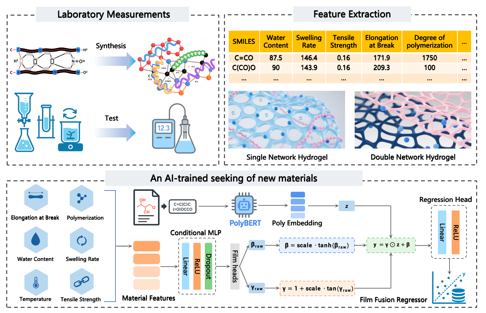

# polyNet: Polymer Property Prediction with polyBERT + FiLM

**polyNet** leverages HuggingFace’s （[`kuelumbus/polyBERT`](https://huggingface.co/kuelumbus/polyBERT)）to encode polymer SMILES and applies FiLM (Feature-wise Linear Modulation) to condition material tabular features, enabling regression prediction of target properties (e.g., conductivity).



## Features

* FiLM-based model with a dense FiLM head
* Training and inference based on polyBERT embeddings
* One-command terminal training and batch inference

## Environment Setup

```bash
python3 -m venv .venv
source .venv/bin/activate
pip install -r requirements.txt
```

Optional: configure cache directories (to speed up polyBERT downloads):

```bash
export HF_HOME=./.cache/huggingface
export TRANSFORMERS_CACHE=./.cache/huggingface
export TORCH_HOME=./.cache/torch
```

## Dataset Preparation

* **Training data**: preferably in Excel (`.xlsx`) format, including:

  * Required columns: `SMILES`, target property column (e.g., `Conductivity`)
  * Optional feature columns (examples): `WaterContent`, `SwellingRate`, `Degreeofpolymerization`, `ElongationatBreak`, `TensileStrength`
* **Inference data**: CSV file containing at least the `SMILES` column; if feature columns were used during training, the same columns must be present.

Example directory structure:

```
datasets/
  └── dataset.xlsx
```

## Training (Terminal)

Example command:

```bash
python3 TrainModel.py \
  --data_path datasets/20C_dataset.xlsx \
  --target_col Conductivity \
  --features WaterContent,SwellingRate,Degreeofpolymerization,ElongationatBreak,TensileStrength \
  --epochs 80 \
  --batch_size 2 \
  --lr 1e-3 \
  --weight_decay 1e-4 \
  --optimizer adamw \
  --loss smoothl1 \
  --lr_scheduler plateau \
  --plateau_patience 10 \
  --plateau_factor 0.6 \
  --plateau_min_lr 1e-5 \
  --clip_grad_norm 1.0 \
  --test_size 2 \
  --seed 42
```

Training output directory example: `trained_models/film_model/`

* `model.pth` (model weights and metadata)
* `results.json` (training configuration and metrics)
* Optional visualization logs/plots

Notes:

* Automatically detects GPU/CPU; polyBERT will be downloaded on first run
* The order of `--features` must match the column order in the dataset

## Inference (Terminal)

Batch prediction from CSV:

```bash
python3 PredictModel.py \
  --model trained_models/film_model \
  --csv path/to/data.csv \
  --smiles_col SMILES \
  --out path/to/pred.csv
```

* `--model` can be a directory or a direct path to `model.pth`
* Input CSV must contain `SMILES`; if features were used in training, they must also be provided with the same column names
* Output CSV will include a new column with predictions (default name: `Predicted_Conductivity`)

## License

© 2025 menghaoyoung. All Rights Reserved.

This code and associated documentation are proprietary and confidential.
Unauthorized copying, modification, distribution, or use of this project, in whole or in part, is strictly prohibited without prior written permission from the author(s).

This project makes use of polyBERT (MIT License) from [huggingface.co/kuelumbus/polyBERT](https://huggingface.co/kuelumbus/polyBERT). All rights to polyBERT remain with its original authors.
